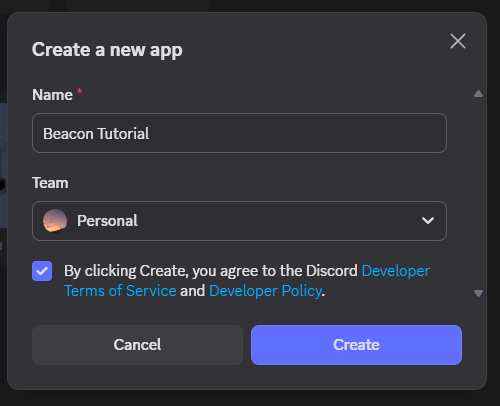
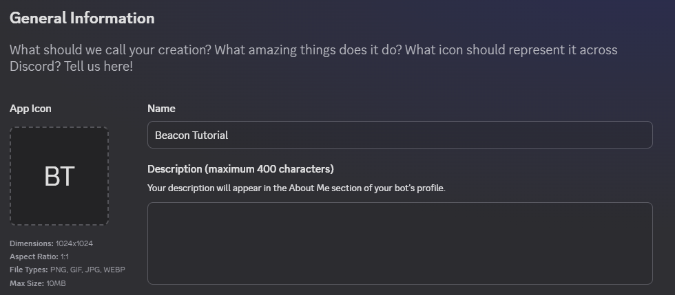
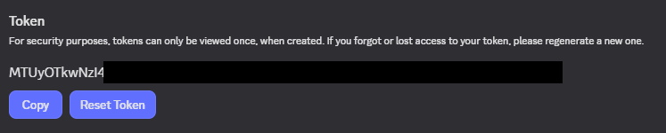
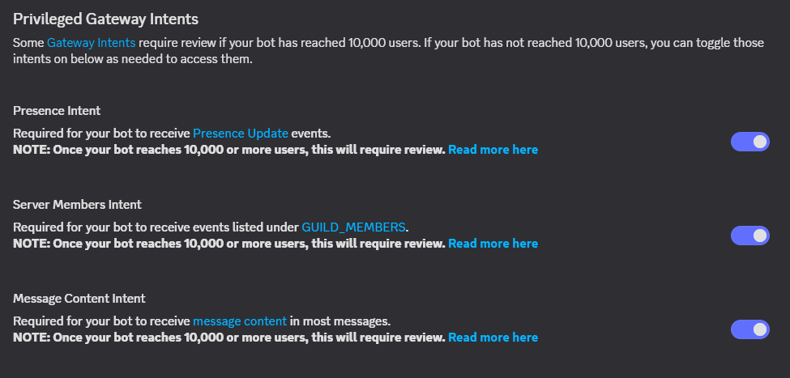

# Creating a Discord app
Before you even begin to host the bot itself, you need to make an app on the Discord Developer Portal. This is what you actually invite to your Discord server.

1. Go to the [Discord Developer Portal](https://discord.com/developers/applications) and sign in.

2. Click 'New Application' in the top right and give it a name before agreeing to the Discord Developer ToS and clicking 'Create' in the window that appears.

    

3. You're now on your bot's application page. On the 'General Information' page, set an app icon, name (this is what appears as the bot's display name in Discord), description (the bot user's bio in Discord) and app icon.

    

4. Click 'Bot' in the sidebar, and click the purple 'Reset Token' button. It will get you to authenticate if you have multi-factor authentication enabled, so do this. Copy the token and save it somewhere safe, as you **cannot see this token again without generating a new one.**

    

5. Scroll down and turn on all the switches under 'Privileged Gateway Intents' and save.

    

6. Click 'OAuth2' in the sidebar and go to the 'OAuth2 URL Generator' section. From here:
    1. Tick the `bot` box.
    2. Scroll down and click 'Administrator' under 'General Permissions' (1).
    3. Change 'Integration Type' to 'Guild Install' in the drop down list.
    4. Copy the URL under 'Generated URL', visit it, and invite the bot to the server you need it in.

Congratulations, you have invited the bot to your server and can move on to hosting it!

